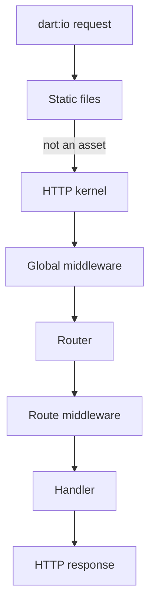

Archery separates application startup from request handling. Startup builds the services the application needs; the HTTP pipeline then reuses those services for each incoming request.

## Application startup

A typical application starts in this order:

<Steps>
  <Step title="Create the application">
    `App()` provides the central application object and service container.
  </Step>
  <Step title="Load configuration">
    `AppConfig.create()` reads JSON configuration files and is usually bound as an eager singleton.
  </Step>
  <Step title="Register providers">
    Providers bind services, migrations, clients, seeders, or other application capabilities.
  </Step>
  <Step title="Boot the application">
    `app.boot()` prepares framework services, initializes eager bindings, and runs provider boot work.
  </Step>
  <Step title="Resolve runtime services">
    After boot, resolve services such as `Router` and `StaticFilesServer` from the container.
  </Step>
</Steps>

```dart
final app = App();
final config = await AppConfig.create();

app.container.singleton<AppConfig>(
  factory: (_, [_]) => config,
  eager: true,
);

app.registerGroup('migrations', [
  SqliteMigrationsProvider(),
]);

await app.boot();
```

<Note>
  A provider's `register()` phase defines bindings. Its `boot()` phase performs work that may depend on bindings from other providers.
</Note>

## Request lifecycle



For each incoming request:

1. `HttpServer` yields a `HttpRequest`.
2. `StaticFilesServer.tryServe()` handles matching public assets.
3. `AppKernel.handle()` prepares the request and invokes global middleware.
4. `Router.dispatch()` matches an exact or typed dynamic route.
5. Route middleware runs in its defined order.
6. The route handler writes a JSON, text, view, redirect, file, or error response.
7. Unmatched requests receive the framework's 404 response.

## Component responsibilities

| Component | Responsibility |
| --- | --- |
| `App` | Coordinates registration, boot hooks, application state, and shutdown |
| `ServiceContainer` | Registers and resolves application services |
| `Provider` | Packages service registration and startup work |
| `AppKernel` | Starts the request pipeline and global middleware |
| `Router` | Matches methods and paths, then invokes route middleware and handlers |
| `FormRequest` | Exposes cached query, body, and uploaded-file input |
| `TemplateEngine` | Renders server-side templates |
| `Model` | Provides persistence operations across configured database drivers |

## Failure and shutdown

A startup or listener failure should be logged and followed by explicit resource cleanup. Close the HTTP server and external clients, call `app.container.dispose()` when you rely on container disposal callbacks, and then call `app.shutdown()` to update the application lifecycle.

```dart
try {
  // Bind and run the server.
} catch (error, stack) {
  app.archeryLogger.error('Application error', {
    'error': error.toString(),
    'stack': stack.toString(),
  });
  await app.container.dispose();
  await app.shutdown();
}
```

<CardGroup cols={2}>
  <Card title="Service container" icon="cubes" href="/core/container">
    Learn how Archery owns and resolves services.
  </Card>

  <Card title="Build a small app" icon="hammer" href="/getting-started/build-an-app">
    Apply the request lifecycle in a working JSON API.
  </Card>
</CardGroup>
