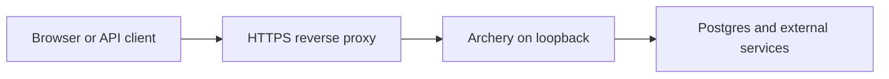

Archery runs as a native Dart process. A production deployment normally consists of a compiled application, a process supervisor, and an HTTPS reverse proxy.

<Warning>
  Archery 1.5.0 is a stable-alpha, early-production release. Load-test your application, review framework changes before upgrading, and keep a rollback artifact for every deployment.
</Warning>

## Production topology



The reverse proxy owns public TLS, request-size limits, and forwarded headers. Archery listens on a private loopback port and handles application requests.

## Compile the application

From the project root:

```bash
dart pub get
dart analyze
dart test
mkdir -p build
dart compile exe bin/server.dart -o build/archery_app
```

Copy the compiled executable together with the configuration, templates, and public assets required at runtime. Keep releases in versioned directories so you can switch back to a previous artifact.

<Note>
  Compiling the executable does not embed application files that your code reads from disk. Deploy `lib/src/config`, `lib/src/http/views`, and `lib/src/http/public` when your application uses them.
</Note>

## Bind to a private address

When NGINX or Caddy runs on the same host, bind Archery to loopback:

```dart
final port = config.get('server.port') ?? 5502;

final server = await HttpServer.bind(
  InternetAddress.loopbackIPv4,
  port,
  shared: true,
);

server.autoCompress = config.get('server.compress', true);
```

Do not bind the application directly to a public interface unless the surrounding network policy is intentionally designed for it.

## Inject secrets

Committed JSON files should contain non-sensitive defaults. Read production secrets from the process environment and apply them before providers that depend on them boot:

```dart
final config = await AppConfig.create();

final databasePassword = Platform.environment['DB_PASSWORD'];
if (databasePassword != null) {
  config.set('db.pgsql.password', databasePassword);
}

app.container.singleton<AppConfig>(
  factory: (_, [_]) => config,
  eager: true,
);
```

Use your hosting platform, secret manager, or process supervisor to supply values such as database passwords and AWS credentials. Do not print secrets in startup logs.

## Run under systemd

A service unit keeps the application running and restarts it after recoverable failures:

```ini
[Unit]
Description=Archery application
After=network.target

[Service]
Type=simple
User=www-data
Group=www-data
WorkingDirectory=/var/www/archery/current
ExecStart=/var/www/archery/current/build/archery_app
Restart=on-failure
RestartSec=5
Environment=APP_ENV=production
EnvironmentFile=-/etc/archery/archery.env

[Install]
WantedBy=multi-user.target
```

After installing or changing the unit:

```bash
sudo systemctl daemon-reload
sudo systemctl enable --now archery
sudo systemctl status archery
```

Keep the environment file readable only by the service account and administrators.

## Proxy through NGINX

The following server block terminates public traffic and forwards requests to Archery:

```nginx
server {
    listen 80;
    server_name example.com;

    client_max_body_size 10m;

    location / {
        proxy_pass http://127.0.0.1:5502;
        proxy_http_version 1.1;

        proxy_set_header Host $host;
        proxy_set_header X-Real-IP $remote_addr;
        proxy_set_header X-Forwarded-For $proxy_add_x_forwarded_for;
        proxy_set_header X-Forwarded-Proto $scheme;

        proxy_read_timeout 60s;
        proxy_send_timeout 60s;
    }
}
```

Add TLS through your normal certificate workflow before enabling authentication or transmitting sensitive data.

## Set application response headers

Apply explicit security headers and configure CORS for the origins that should access the application:

```dart
server.defaultResponseHeaders.clear();
server.defaultResponseHeaders.add(
  'X-Content-Type-Options',
  'nosniff',
);
server.defaultResponseHeaders.add(
  'X-Frame-Options',
  'SAMEORIGIN',
);
```

<Warning>
  The bundled example uses `Access-Control-Allow-Origin: *` for development convenience. Do not combine a wildcard origin with authenticated browser traffic. Configure a trusted allowlist instead.
</Warning>

## Shut down cleanly

Closing the listener stops new requests. Dispose the container to run registered cleanup callbacks, then shut down the application lifecycle:

```dart
Future<void> stop() async {
  await server.close(force: false);
  await app.container.dispose();
  await app.shutdown();
}

ProcessSignal.sigterm.watch().listen((_) async {
  await stop();
  exit(0);
});

ProcessSignal.sigint.watch().listen((_) async {
  await stop();
  exit(0);
});
```

Your database clients, file handles, and other external resources should register disposal callbacks or be closed explicitly.

## Verify the release

Before directing public traffic to a new release:

- Confirm the service starts without provider or migration errors.
- Request a dedicated health endpoint.
- Verify that templates and static assets are present.
- Confirm the application can reach its Postgres connection.
- Test authentication cookies over HTTPS.
- Submit a state-changing form and verify CSRF protection.
- Confirm CORS rejects untrusted origins.
- Inspect service and reverse-proxy logs.
- Exercise shutdown and restart behavior.
- Preserve the previous executable and runtime files for rollback.

<CardGroup cols={2}>
  <Card title="Architecture" icon="diagram-project" href="/getting-started/architecture">
    Review application boot and shutdown responsibilities.
  </Card>

  <Card title="Configuration" icon="gear" href="/core/configuration">
    Learn how configuration is loaded and overridden.
  </Card>
</CardGroup>
